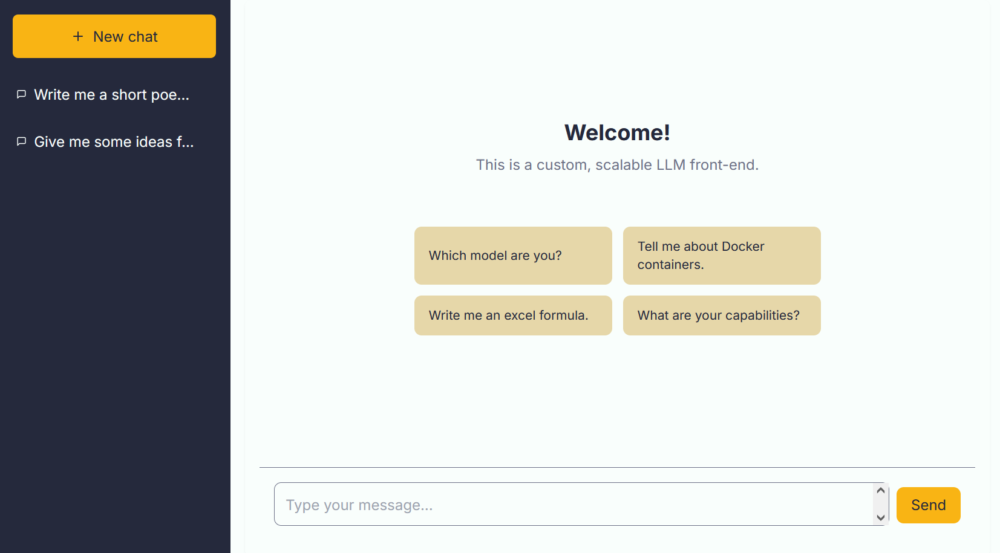

# LLM Front-End Application

A containerized chat application with a React frontend and FastAPI backend, designed as a starting point to create a customized chat interface.

<center>
  
</center>

## Features

- **React Frontend**
  - Responsive design with Tailwind CSS
  - Conversation history and management
  - Clean, intuitive interface

- **FastAPI Backend**
  - RESTful API that can be extended
  - MongoDB integration for persistent storage
  - Asynchronous request handling

- **Deployment**
  - Docker containerization utilizing docker compose

## Getting Started

### Prerequisites

- Docker and Docker Compose
- OpenAI API key
- Node.js and npm (for local development)

### 1. Clone the repository

```bash
git clone https://github.com/CampbellJohn/llm-front-end.git
cd llm-front-end
```

### 2. Set up environment variables

Create a `.env` file in the project root:

```env
# OpenAI
OPENAI_API_KEY=your_openai_api_key_here

# MongoDB
MONGODB_URL=mongodb://mongodb:27017/llm_chat_db
MONGODB_DB_NAME=llm_chat_db

# Frontend (optional, for local development without Docker)
REACT_APP_API_URL=http://localhost:8000
```

### 3. Run with Docker (Recommended)

```bash
docker-compose up --build
```

This will start:
- MongoDB container
- FastAPI backend
- React frontend

### 4. Access the application

- **Frontend**: http://localhost:3000
- **Backend API**: http://localhost:8000
- **API Documentation**: http://localhost:8000/docs

## Project Structure

```
llm-front-end/
├── backend/
│   ├── app/
│   │   ├── api/
│   │   │   └── v1/
│   │   │       ├── endpoints/    # API route handlers
│   │   │       └── models/       # Pydantic models
│   │   ├── core/                # Core configurations
│   │   └── services/            # Business logic
│   └── requirements.txt
├── frontend/
│   ├── public/
│   ├── src/
│   │   ├── components/         # React components
│   │   ├── hooks/              # Custom React hooks
│   │   ├── services/           # API service functions
│   │   └── App.js              # Main application component
│   └── package.json
├── .env.example
├── docker-compose.yml
└── README.md
```